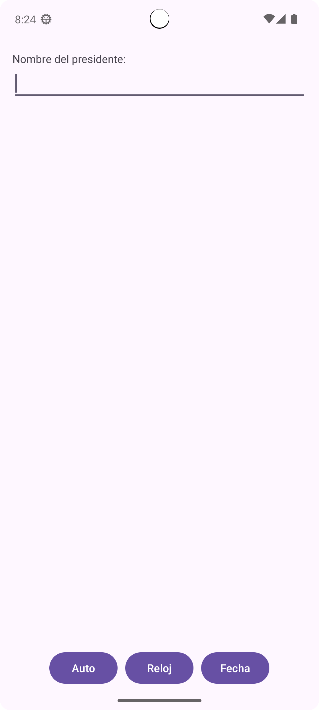
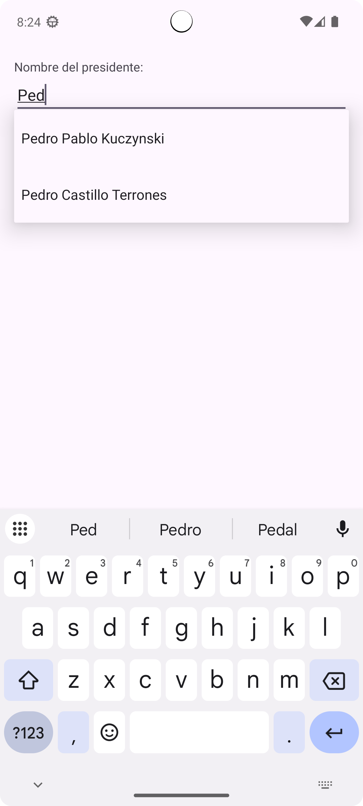
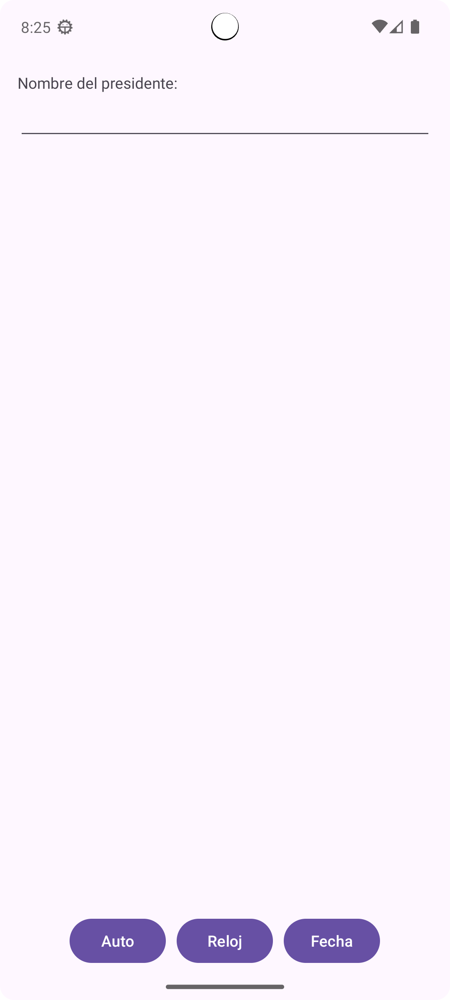
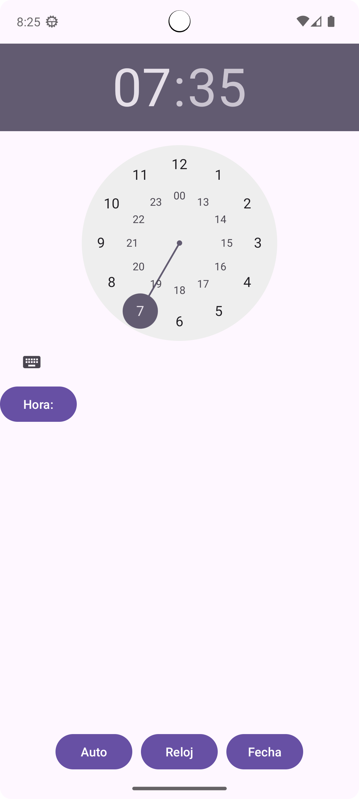
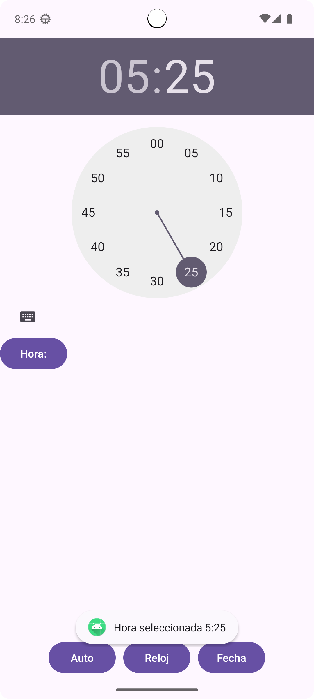
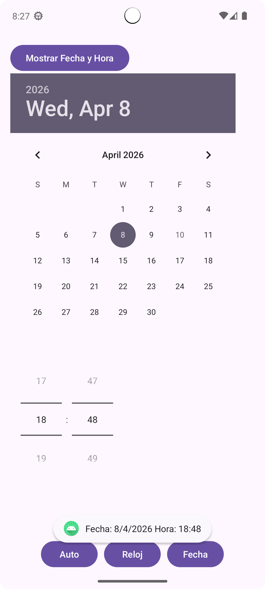

# App con AutoComplete + TimePicker + DatePiker 

## Descripción
Se realizo una aplicación con 3 botones de forma constante y permanentes con LinearLayout + FrameLayout para el cambio dinamico entre las avtividades

---

## Interfaz de la App

**Interfaz**  

## Descripción
En esta actividad se muestra el TextView para ingresar los nombres de los presidentes guardados en nuestra lista, y asu vez las recomendaciones apartir del tercer caracter

---

##  Botones

## Descripción
Boton Auto

## Descripción
Boton Reloj

## Descripción
Boton Fecha

---

## Interfaz de Reloj

**Interfaz**  

## Descripción
En este FrameLayout muestra un reloj configurado en 12 horas + Toast com mensaje de confirmacion de Hora + Minuto

---

## Interfaz de Fecha

**Interfaz**  

## Descripción
En este FrameLayout muestra el calendario del mes de abril configurado  + Toast com mensaje de confirmacion de Dia/Mes/Año

